# Architecture — Central Auth Demo

## Table of Contents

1. [Overview](#overview)
2. [System Architecture](#1-system-architecture)
3. [Domain & Nginx Routing](#2-domain--nginx-routing)
4. [Authentication & Token Flow](#3-authentication--token-flow)
5. [Cookie & Token Scope](#4-cookie--token-scope)
6. [Service Internal Architecture](#5-service-internal-architecture)
7. [Docker Infrastructure](#6-docker-infrastructure)
8. [Data Flow — Protected Page Load](#7-data-flow--protected-page-load)
9. [Logout Flow](#8-logout-flow)

---

## Overview

Central Auth Demo implements a **two-tier token architecture** across four independent microservices behind a single nginx reverse proxy.

**Tier 1 — Central identity token (`central_auth`)**
Issued by the auth service after login. Long-lived (24 h), shared across all `*.centralauth.local` subdomains. Proves *who you are*.

**Tier 2 — Service tokens (`analytics_token`, `report_token`, `transaction_token`)**
Issued by each service on first access, in exchange for a valid central token. Short-lived, host-only, carry service-specific scope and permissions. Prove *what you can do* within that service.

This mirrors how real-world SSO works: one identity provider, multiple resource servers each enforcing their own authorization policies.

**Tech stack**

| Layer | Technology |
|---|---|
| Backend services | Go 1.21 + Gin |
| Frontend | Static HTML + Vanilla JS (nginx-served) |
| Reverse proxy | nginx (alpine) |
| Token format | JWT HS256 |
| Database | PostgreSQL 16 (auth-service only) |
| Container runtime | Docker Compose |

---

## 1. System Architecture

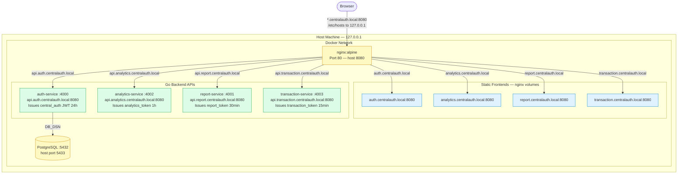

---

## 2. Domain & Nginx Routing

Every subdomain of `centralauth.local` resolves to `127.0.0.1` via `/etc/hosts`. Nginx inspects the `Host` header and routes to the correct static file directory or backend service.

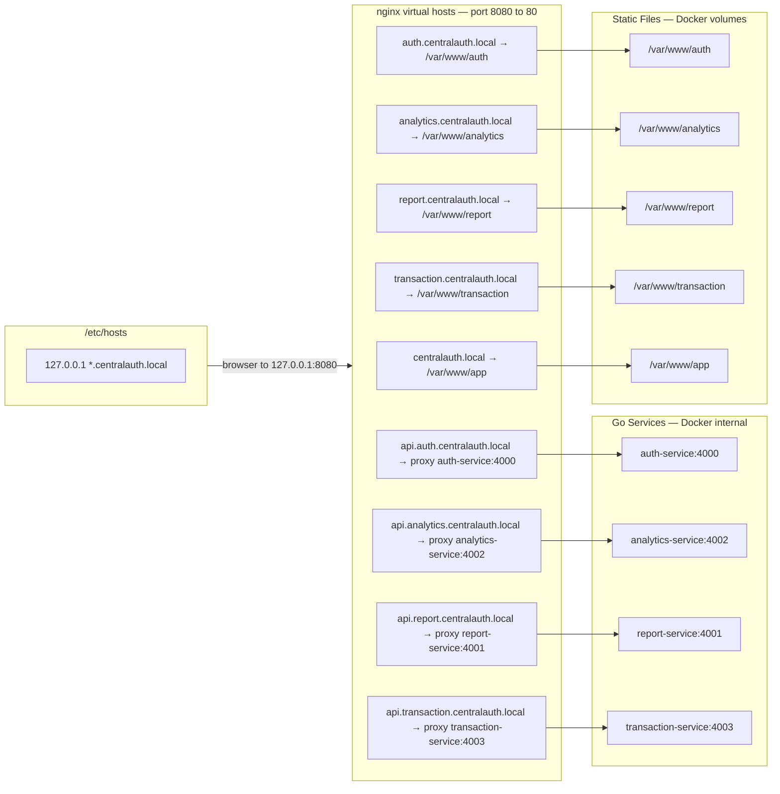

---

## 3. Authentication & Token Flow

### 3a. Login — Central Token Issued Once

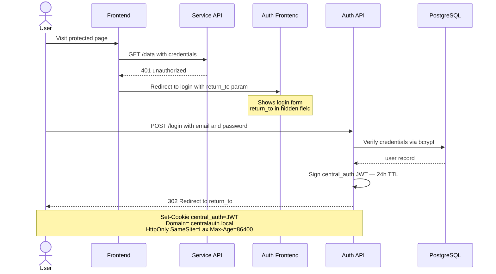

### 3b. First Request to a Service — Token Exchange

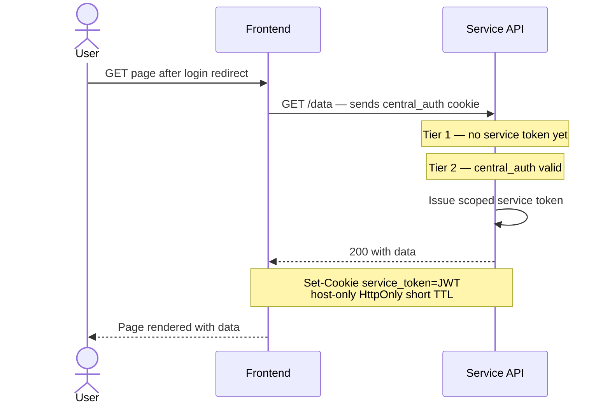

### 3c. Subsequent Requests — Fast Path

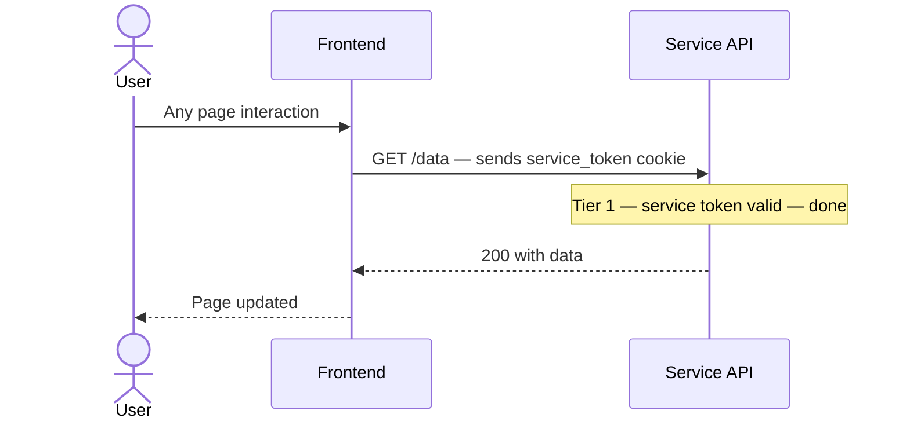

### 3d. Service Token Expiry — Auto-Renewal

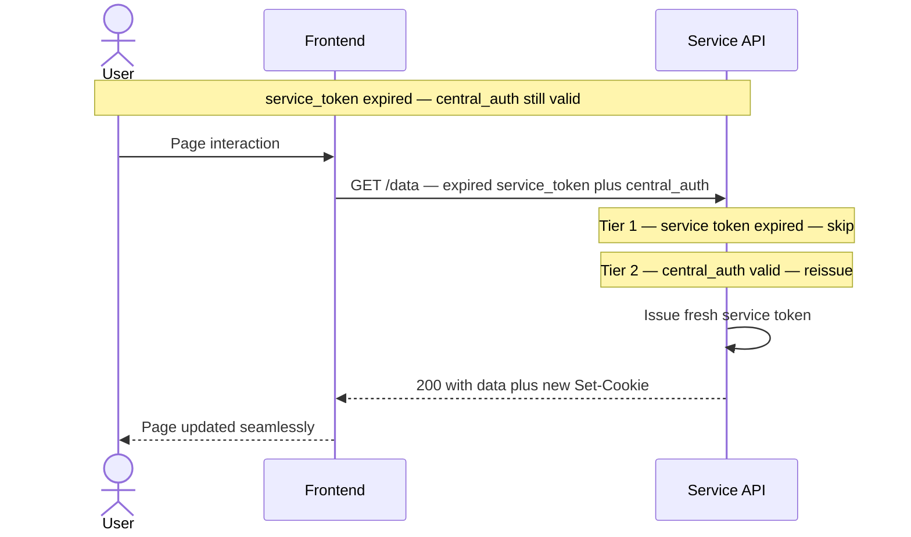

---

## 4. Cookie & Token Scope

### Central token — shared identity

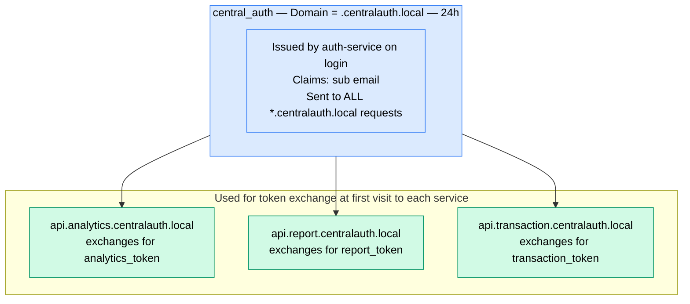

### Service tokens — scoped per service host

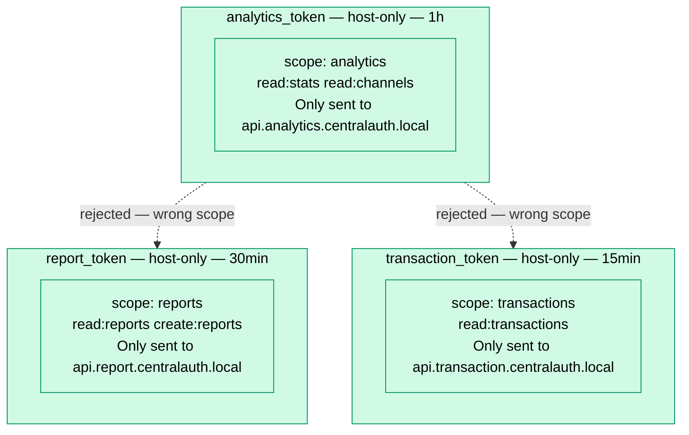

**Why the TTLs differ**

| Token | TTL | Rationale |
|---|---|---|
| `central_auth` | 24h | Identity token — low sensitivity, long session |
| `analytics_token` | 1h | Aggregate metrics — moderate sensitivity |
| `report_token` | 30min | Business reports — higher sensitivity |
| `transaction_token` | 15min | Financial data — most sensitive, shortest window |

---

## 5. Service Internal Architecture

### Shared 3-layer structure (all services)

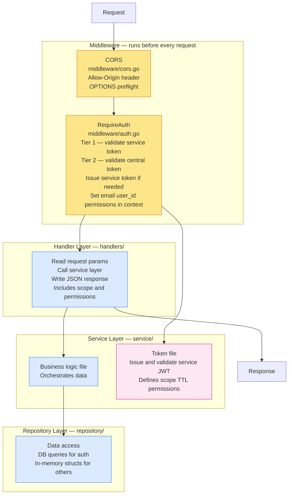

### auth-service — has database, no service token

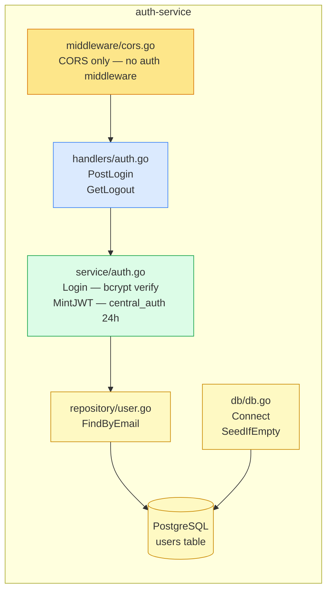

### analytics / report / transaction — two-tier auth, stateless data

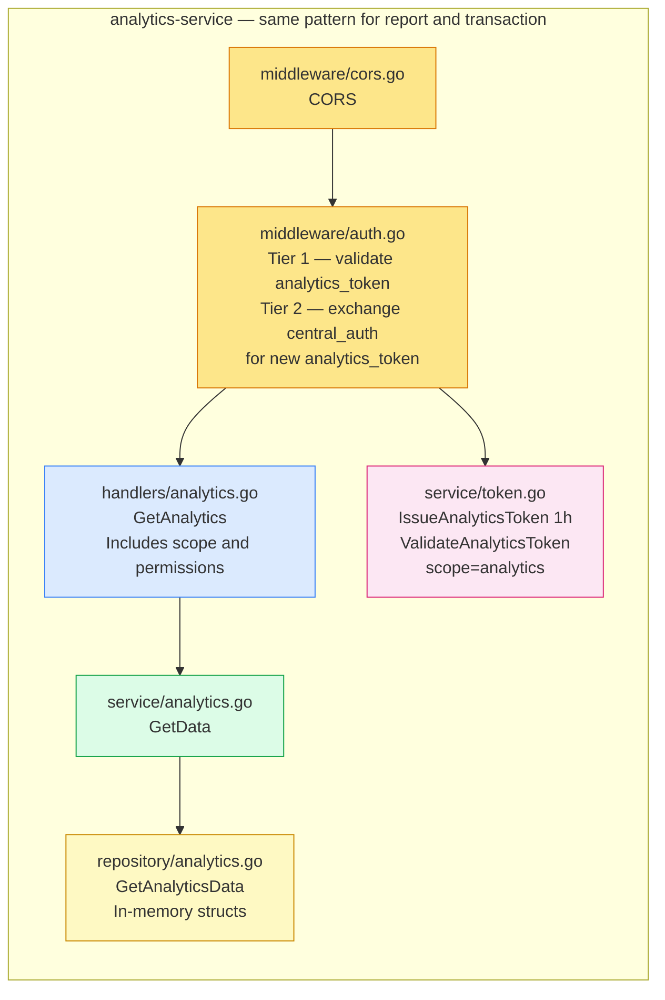

---

## 6. Docker Infrastructure

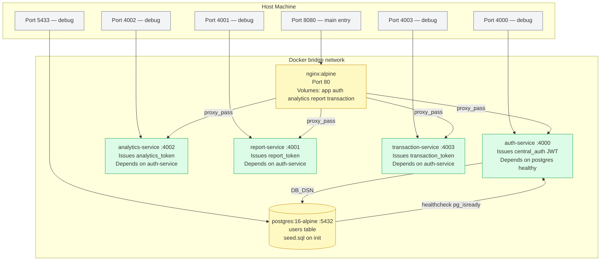

---

## 7. Data Flow — Protected Page Load

### First visit (token exchange happens transparently)

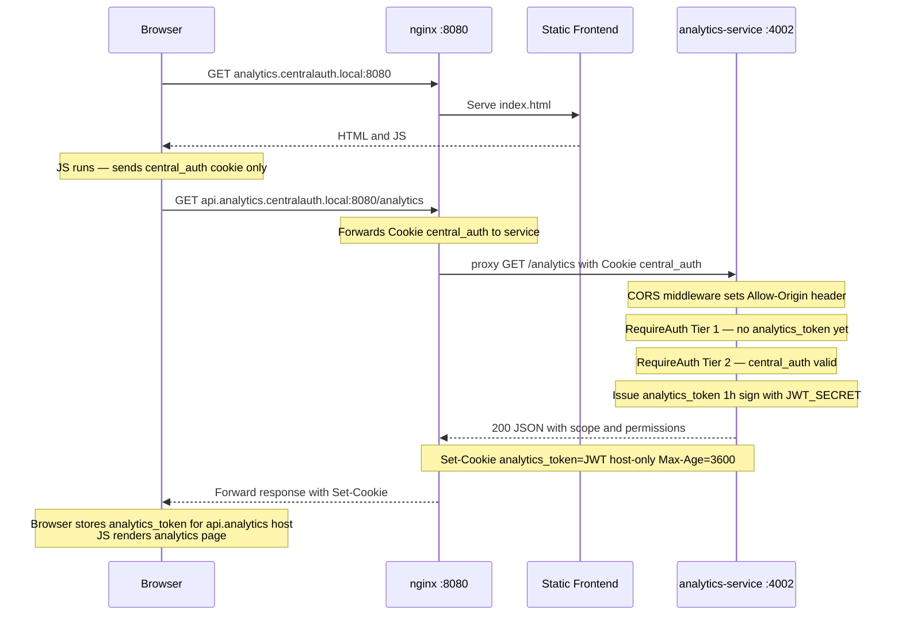

### Subsequent visits (fast path — no token operations)

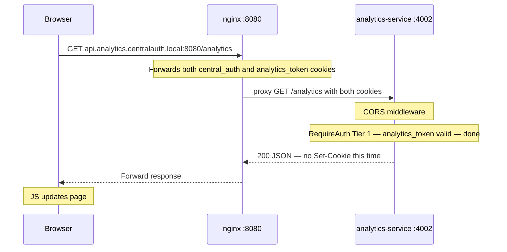

---

## 8. Logout Flow

Logout clears only `central_auth`. Service tokens are short-lived and expire on their own schedule. After logout, `central_auth` is gone so no new service tokens can be issued — all services reject further requests once their service tokens expire.

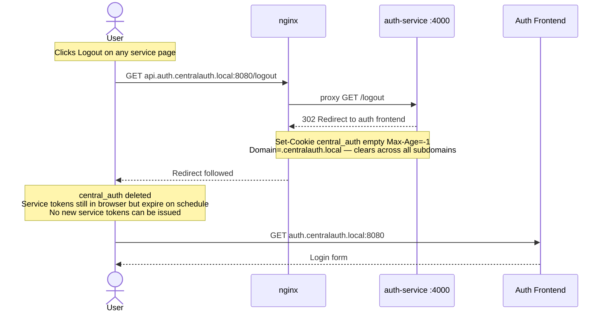
