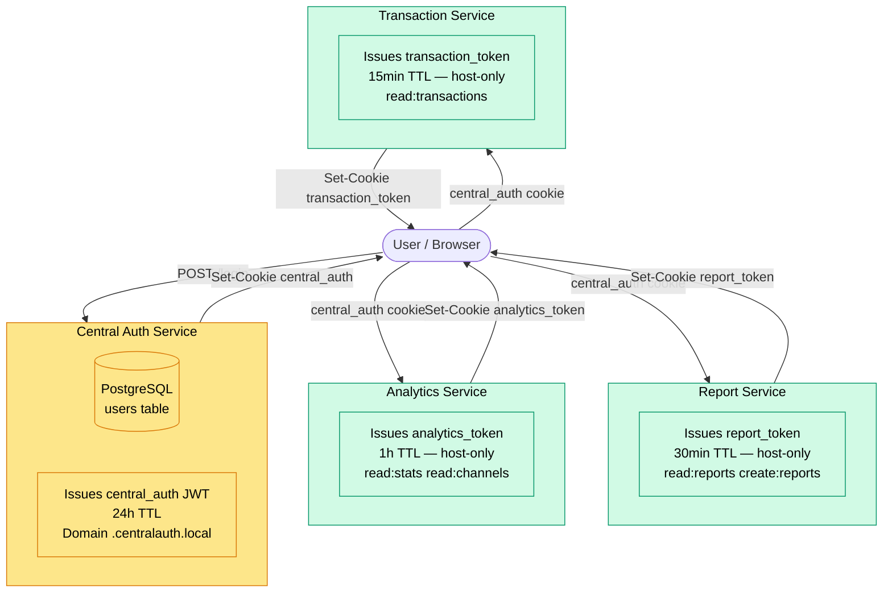
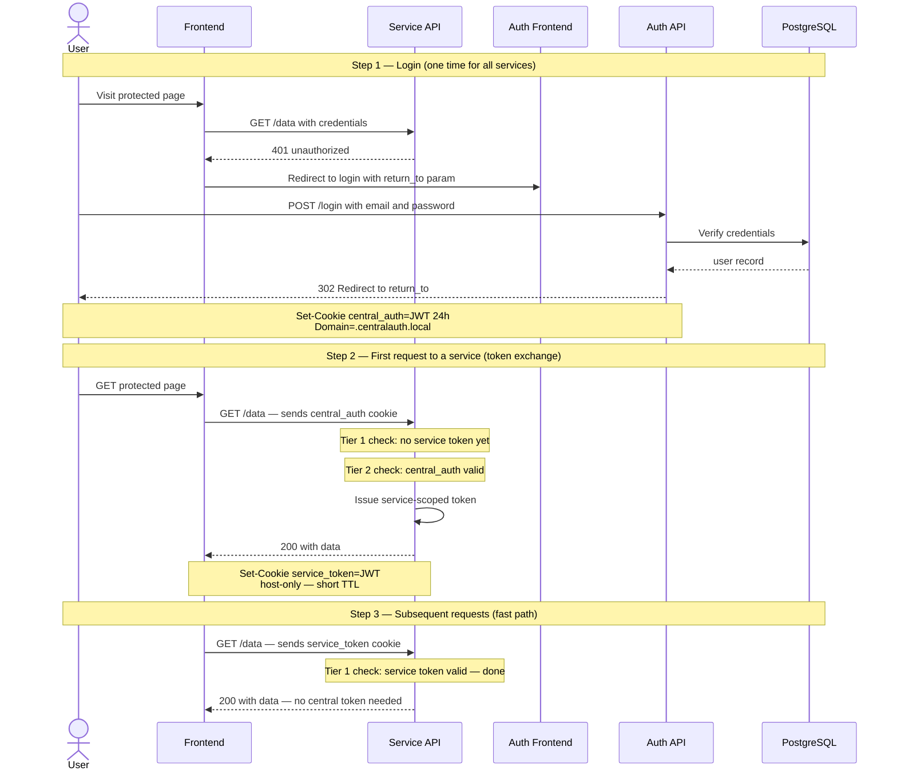
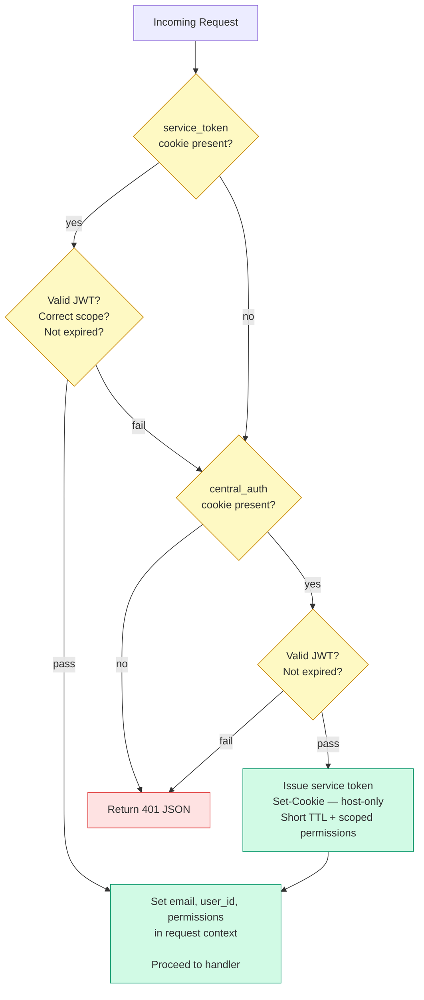
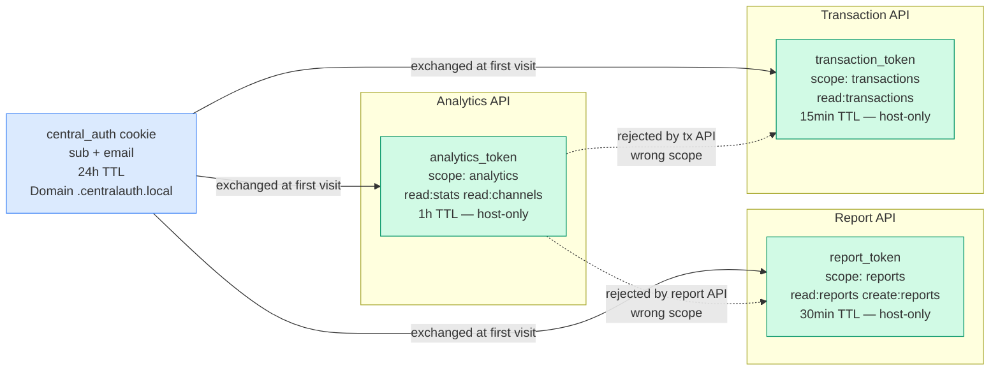
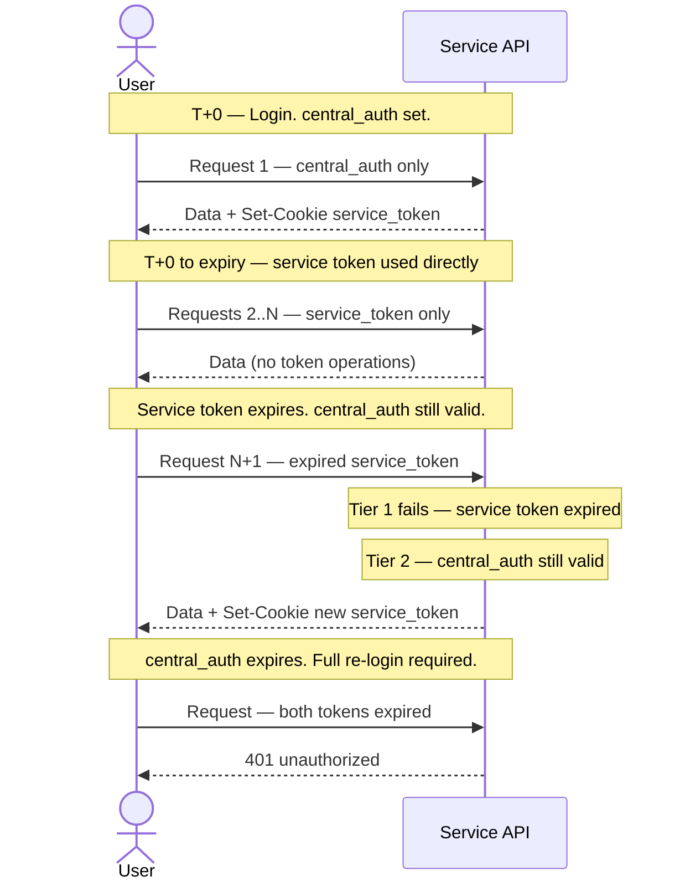
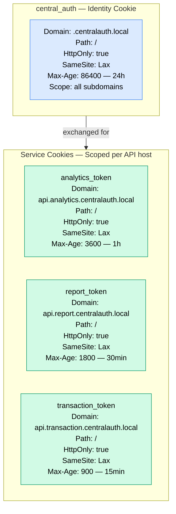

# Central Auth — How It Works

---

## The Core Idea

Two-tier token architecture: **Central Auth** issues a long-lived *identity* token that proves who you are. Each service then exchanges it for a short-lived *service token* scoped to that service's own permissions. Subsequent requests skip the identity check entirely and use the faster service token.

---

## Token Comparison

| | Central Auth Token | Service Token |
|---|---|---|
| **Cookie name** | `central_auth` | `analytics_token` / `report_token` / `transaction_token` |
| **Issued by** | auth | The service itself |
| **TTL** | 24 hours | 1h / 30min / 15min (per service) |
| **Cookie domain** | `.centralauth.local` (shared) | Host-only (service API only) |
| **Claims** | `sub`, `email` | `sub`, `email`, `scope`, `permissions` |
| **Purpose** | Prove identity across all services | Authorize within one service |

---

## 1. System Overview

---

## 2. Two-Tier Auth Flow — First Visit to a Service

---

## 3. Token Validation Logic (per service)

---

## 4. Service Token Scope Isolation

Each service token carries a `scope` claim. A token issued by one service is rejected by another even if the signature is valid.

---

## 5. Full Token Lifecycle

---

## 6. Cookie Properties Side-by-Side

---

## Key Properties

| Property | Central Token | Analytics Token | Report Token | Transaction Token |
|---|---|---|---|---|
| Issued by | auth | analytics | report | transaction |
| TTL | 24h | 1h | 30min | 15min |
| Cookie | `central_auth` | `analytics_token` | `report_token` | `transaction_token` |
| Domain | `.centralauth.local` | host-only | host-only | host-only |
| Scope claim | _(none)_ | `analytics` | `reports` | `transactions` |
| Permissions | _(none)_ | `read:stats` `read:channels` | `read:reports` `create:reports` | `read:transactions` |
| Cross-service usable | Yes (identity) | No (scope rejected) | No (scope rejected) | No (scope rejected) |
| DB required | Yes | No | No | No |
